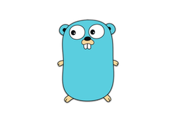

# What Is Godash?

<p align="center">
</img>
</p>

Godash is inspired by [lodash](https://github.com/lodash/lodash) nodejs utility library delivering modularity.

Basically we are going to use their documentation and recreate what they did in nodejs, inside golang and of course if anyone wants to add more tools than lodash documentation, please feel free to create an issue, fork and contribute.
## Our Goals

This is a repository driven by golang community, 

If you love to contribute, please do, we appreciate it.

And ofcourse don't forget to read [CONTRIBUTING](/CONTRIBUTING.md) documentation to know about how to contribute in this project.

## Tests and Benchmarks

Just a reminder on how to run test cases and benchmarks.

#### Test Cases

```bash
go test github.com/golodash/godash/<your desired package>
```

#### Benchmarks

```bash
go test -bench=. -benchtime=5s github.com/golodash/godash/<your desired package>
```
